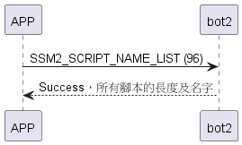

# Item: Script Name List

取得bot2中所有腳本的名字。

## 循序圖

<p align="left" >
  
</p>

## 手機傳送資料

| Byte |     0     |
|------|:---------:|
| Data | item_code |

item code : SSM2_SCRIPT_NAME_LIST (96)

## bot2 回傳資料

| Byte |  N ~ 3  |   2    |     1     |  0   |
|------|:-------:|:------:|:---------:|:----:|
| Data | payload |  res   | item_code | type |
| 說明   | 所有腳本的名字 | 命令處裡狀態 |   指令編號    | 推送類型 |

type : SSM2_OP_CODE_RESPONSE (0x07)

item code : SSM2_SCRIPT_NAME_LIST (96)

res : CMD_RESULT_INVALID_ACTION (0x09)

payload : 如以下表格

### payload(所有腳本名字)

| Byte | ... | 41 ~ 22 |    21     | 20 ~ 1 |     0     |
|------|:---:|:-------:|:---------:|:------:|:---------:|
| Data | ... |  name2  | name2_len | name1  | name1_len |

## bot2動作腳本結構

```c
#pragma pack(1)
typedef struct {
    uint8_t len;
    uint8_t data[MAX_SCRIPT_NAME_LEN];//20 bytes
} script_name_t;
#pragma pack()
```

## android 範例

```java
    override fun getScriptNameList(result: CHResult<Int>) { //todo 回傳
        if (checkBle(result)) return
        L.d("hcia", "[send]getScriptNameList")
        sendCommand(SesameOS3Payload(SesameItemCode.SCRIPT_NAME_LIST.value, byteArrayOf()), DeviceSegmentType.cipher) { res ->
            L.d("hcia", "[getScriptNameList] all: " + res.payload.toHexString())
            val nowScriptID = res.payload[0].toInt()
            val scriptCount = res.payload[1].toInt()
            val scriptName = res.payload.sliceArray(2 until res.payload.size)
            L.d("hcia", "[getScriptNameList] nowScriptID:$nowScriptID")
            L.d("hcia", "[getScriptNameList] scriptCount:$scriptCount")

            var index = 0 // 資料開始的索引
            for (i in 0 until scriptCount) {
                val nameLength = scriptName[index].toInt() // 獲取腳本名稱的長度
                index++ // 移動到名稱數據的開始位置

                val nameBytes = scriptName.copyOfRange(index, index + nameLength)
                val name = String(nameBytes, Charsets.UTF_8) // 假設名稱使用 UTF-8 編碼
                L.d("hcia", "[getScriptNameList] 腳本:$i len:$nameLength neme:$name")

                index += 20 // 移動到下一個腳本名稱的長度位置
            }


            result.invoke(Result.success(CHResultState.CHResultStateBLE(res.payload[0].toInt())))
        }
    }
```
