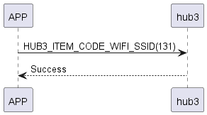

# Item: SSID Get

手機發送拿wifi_ssid指令給 hub3 回覆指令成功，之後會將掃描到的ssid列表傳給手機。

## 循序圖

  

## 手機送出資料

| Byte |     0     |
|------|:---------:|
| Data | item code |

item code : HUB3_ITEM_CODE_WIFI_SSID (131)

## hub3 回傳內容

| Byte |   2    |     1     |  0   |
|------|:------:|:---------:|:----:|
| Data |  res   | item_code | type |
| 說明   | 命令處裡狀態 |   指令編號    | 推送類型 |

type : SSM2_OP_CODE_RESPONSE (0x07)

item code : HUB3_ITEM_CODE_WIFI_SSID (131)

res : CMD_RESULT_SUCCESS (0x00)