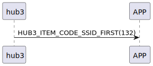

# Item: SSID First

hub3 收到 `131_ssid_get` 後 hub3 送出 SSID First 指令，表示接下來要開始傳送SSID給手機了(
詳見 `133_ssid_notify`)。

## 循序圖

  

## hub3 推送內容

| Byte |     1     |  0   |
|------|:---------:|:----:|
| Data | item_code | type |
| 說明   |   指令編號    | 推送類型 |

type : SSM2_OP_CODE_PUBLISH (0x08)

item code : HUB3_ITEM_CODE_SSID_FIRST (132)

