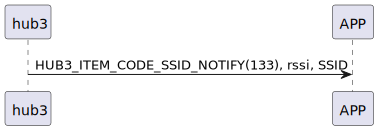

# Item: SSID Notify

hub3 主動推送SSID資料給手機。

## 循序圖

<p align="left" >
  
</p>

## hub3 推送內容

| Byte |  N ~ 2  |     1     |  0   |
|------|:-------:|:---------:|:----:|
| Data | payload | item_code | type |
| 說明   | 送給手機的資料 |   指令編號    | 推送類型 |

type : SSM2_OP_CODE_PUBLISH (0x08)

item code : HUB3_ITEM_CODE_SSID_NOTIFY (133)

payload : 詳見以下表格

### payload

| Byte | 33 ~ 2 | 1 ~ 0 |
|:----:|:------:|:-----:|
| Data |  ssid  | rssi  |

### payload 結構
```c
typedef struct {
    int16_t rssi;
    uint8_t ssid[32];
} wifi_ssid_t;
```


