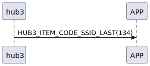

# Item: SSID Last

hub3 送完SSID資料後，送SSID Last給手機，表示SSID資料已經送完了。

## 循序圖

  

## hub3 推送內容

| Byte |     1     |  0   |
|------|:---------:|:----:|
| Data | item_code | type |
| 說明   |   指令編號    | 推送類型 |

type : SSM2_OP_CODE_PUBLISH (0x08)

item code : HUB3_ITEM_CODE_SSID_LAST (134)
