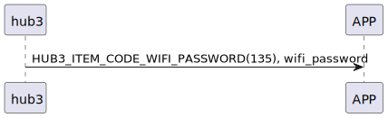

# Item: Setting wifi password

選擇wifi SSID後送出該的密碼給hub3連該熱點。

## 循序圖

  

## 手機送出資料

| Byte |     N ~ 1     |     0     |
|------|:-------------:|:---------:|
| Data | wifi_password | item code |

item code : HUB3_ITEM_CODE_WIFI_PASSWORD (135)

## hub3 回傳內容

| Byte |   2    |     1     |  0   |
|------|:------:|:---------:|:----:|
| Data |  res   | item_code | type |
| 說明   | 命令處裡狀態 |   指令編號    | 推送類型 |

type : SSM2_OP_CODE_RESPONSE (0x07)

item code : HUB3_ITEM_CODE_WIFI_PASSWORD (135)

res : CMD_RESULT_SUCCESS (0x00)