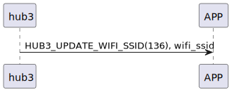

# Item: Setting wifi SSID

選擇hub3要連的wifi AP的SSID。

## 循序圖

  

## 手機送出資料

| Byte |   N ~ 1   |     0     |
|------|:---------:|:---------:|
| Data | wifi_ssid | item code |

item code : HUB3_UPDATE_WIFI_SSID (136)

## hub3 回傳內容

| Byte |   2    |     1     |  0   |
|------|:------:|:---------:|:----:|
| Data |  res   | item_code | type |
| 說明   | 命令處裡狀態 |   指令編號    | 推送類型 |

type : SSM2_OP_CODE_RESPONSE (0x07)

item code : HUB3_UPDATE_WIFI_SSID (136)

res : CMD_RESULT_SUCCESS (0x00)