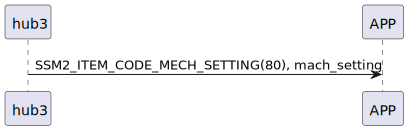

# Item: mech setting

hub3 主動推送機械設定(當前連線的wifi SSID及密碼)給手機。

## 循序圖

<p align="left" >
  
</p>

## hub3 推送內容

| Byte |     61~2     |     1     |  0   |
|------|:------------:|:---------:|:----:|
| Data |   payload    | item_code | type |
| 說明   | mech_setting |   指令編號    | 推送類型 |

type : SSM2_OP_CODE_PUBLISH (0x08)

item code : SSM2_ITEM_CODE_MECH_SETTING (80)

payload : mech_status

### mech_setting 結構

```c
typedef struct {
    uint8_t ssid[30];
    uint8_t password[30];
} wifi_setting_t; // 60 bytes

```

 
