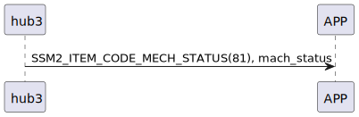

# Item: mech status

hub3 主動推送機械狀態給手機。

## 循序圖

<p align="left" >
  
</p>

## hub3 推送內容

| Byte |      2      |     1     |  0   |
|------|:-----------:|:---------:|:----:|
| Data |   payload   | item_code | type |
| 說明   | mech_status |   指令編號    | 推送類型 |

type : SSM2_OP_CODE_PUBLISH (0x08)

item code : SSM2_ITEM_CODE_MECH_STATUS (81)

payload : mech_status

### mech_status 結構

```c
typedef struct {
    uint8_t is_registered : 1;
    uint8_t is_ap_connected : 1;
    uint8_t is_net_connected : 1;
    uint8_t is_iot_connected : 1;
    uint8_t is_ap_check : 1;
    uint8_t is_ap_connecting : 1;
    uint8_t is_net_connecting : 1;
    uint8_t is_iot_connecting : 1;
} wm3_state;

```

 
