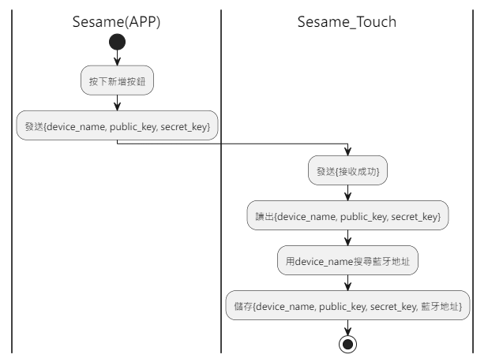
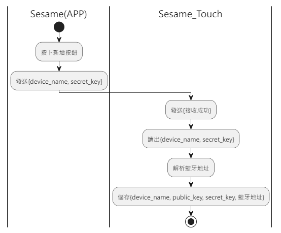

# Item: Add Sesame

手機發送新增指令及 Token，sesame5 回覆指令成功，ssm_touch 主動推送 Sesame 列表給手機。(Sesame 列表詳見 `102_pub_ssm_key`)

## 活動圖 (新增 Sesame4)

Sesame4 的藍牙地址不能用發送資訊解析出來，所以要透過掃描周圍的藍牙裝置，找出 Sesame4 的藍牙地址。

  

## 活動圖 (新增 Sesame5)

Sesame5 的藍牙地址可以用發送資訊解析出來，所以不用掃描周圍的藍牙裝置。

sessionKey = AES_CMAC(key:device_name, input:"candy")

address = sessionKey[0~5]

address[5] |= 0xC0

  

## 循序圖

  

## 手機送出資料

| Byte | 32  ~  17 | 16   ~    1 |     0     |
|------|:---------:|:-----------:|:---------:|
| Data | secretKey | device_name | item code |

item code : SSM3_ITEM_ADD_SESAME (101)

## ssm_touch 回傳內容

| Byte |   2    |     1     |  0   |
|------|:------:|:---------:|:----:|
| Data |  res   | item_code | type |
| 說明   | 命令處裡狀態 |   指令編號    | 推送類型 |

type : SSM2_OP_CODE_RESPONSE (0x07)

item code : SSM3_ITEM_ADD_SESAME (101)

res : CMD_RESULT_SUCCESS (0x00)