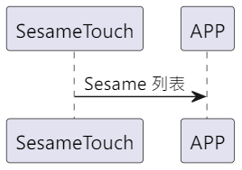

# Item: Publish Sesame Key

ssm_touch 主動推送 Sesame 列表給手機。

## 循序圖

<p align="left" >
  
</p>

## ssm_touch 推送內容

| Byte |  N ~ 2  |     1     |  0   |
|------|:-------:|:---------:|:----:|
| Data | payload | item_code | type |
| 說明   | 送給手機的資料 |   指令編號    | 推送類型 |

type : SSM2_OP_CODE_PUBLISH (0x08)

item code : SSM2_ITEM_CODE_INITIAL (102)

payload : 詳見以下表格

### payload

| Byte |     68      |  67 ~ 46  |     45      |  44 ~ 23  |     22      |  21 ~ 0   |
|:----:|:-----------:|:---------:|:-----------:|:---------:|:-----------:|:---------:|
| Data | ssm2_status | ssm2_name | ssm1_status | ssm1_name | ssm0_status | ssm0_name |

### Sesame Status

```c
typedef enum {
    SSM2_NOUSE = 0,
    SSM2_DISCONNECTED = 1,
    SSM2_SCANNING = 2,
    SSM2_CONNECTING = 3,
    SSM2_CONNECTED = 4,
    SSM2_LOGGIN = 5,
    SSM2_LOCKED = 6,
    SSM2_UNLOCKED = 7,
    SSM2_MOVED = 8,
} ss2_device_status;
```