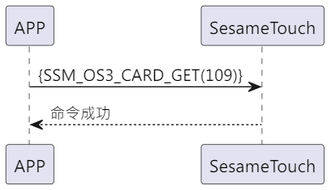

# Item: Card Get

手機發送拿卡指令給ssm_touch 回覆指令成功，之後會將卡片資料傳給手機。

## 循序圖

  

## 手機送出資料

| Byte |     0     |
|------|:---------:|
| Data | item code |

item code : SSM_OS3_CARD_GET (109)

## ssm_touch 回傳內容

| Byte |   2    |     1     |  0   |
|------|:------:|:---------:|:----:|
| Data |  res   | item_code | type |
| 說明   | 命令處裡狀態 |   指令編號    | 推送類型 |

type : SSM2_OP_CODE_RESPONSE (0x07)

item code : SSM_OS3_CARD_GET (109)

res : CMD_RESULT_SUCCESS (0x00)