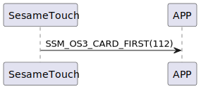

# Item: Card First

ssm_touch 收到 `109_card_get` 後ssm_touch送出 Card First 指令，表示接下來要開始傳送卡片資料給手機了(詳見 `110_card_notify`)。

## 循序圖

  

## ssm_touch 推送內容
| Byte | 1         | 0    |
|-------|:---------:|:----:|
| Data  | item_code | type |
| 說明    | 指令編號      | 推送類型 |

type : SSM2_OP_CODE_PUBLISH (0x08)

item code : SSM_OS3_CARD_FIRST (112)

