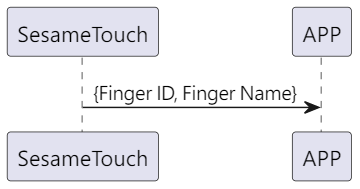
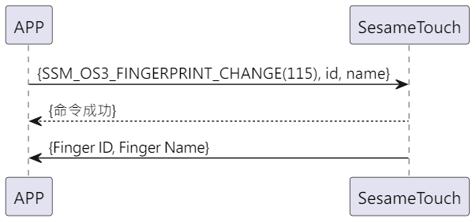

# Item: Finger Change

1. ssm_touch 加入新指紋，主動推送新指紋ID及名字給手機。

2. 手機將id及新名稱傳給 ssm_touch，ssm_touch 回傳命令接收成功後修改指紋名稱，並主動推送新指紋ID及名字給手機(
   名字超過20Bytes，只取前20Bytes)。

## 循序圖 (新增指紋)

  

## 循序圖 (修改指紋名稱)

  

## 手機送出資料

| Byte | N   ~    1 |     0     |
|------|:----------:|:---------:|
| Data |  payload   | item code |

item code : SSM_OS3_FINGERPRINT_CHANGE (115)

payload : 詳見以下表格

### payload

| Byte | (Finger Name Len + Finger ID Len + 1) ~ (Finger ID Len + 2) | Finger ID Len + 1 | Finger ID Len ~ 1 |       0       |
|:----:|:-----------------------------------------------------------:|:-----------------:|:-----------------:|:-------------:|
| Data |                         Finger Name                         |  Finger Name Len  |     Finger ID     | Finger ID Len |

#### 範例

id_len = 5

name_len = 4

| Byte |   10 ~ 7    |        6        |   5 ~ 1   |       0       |
|:----:|:-----------:|:---------------:|:---------:|:-------------:|
| Data | Finger Name | Finger Name Len | Finger ID | Finger ID Len |

## ssm_touch 回傳內容

| Byte |   2    |     1     |  0   |
|------|:------:|:---------:|:----:|
| Data |  res   | item_code | type |
| 說明   | 命令處裡狀態 |   指令編號    | 推送類型 |

type : SSM2_OP_CODE_RESPONSE (0x07)

item code : SSM_OS3_FINGERPRINT_CHANGE (115)

res : CMD_RESULT_SUCCESS (0x00)

## ssm_touch 推送內容

| Byte |  N ~ 2  |     1     |  0   |
|------|:-------:|:---------:|:----:|
| Data | payload | item_code | type |
| 說明   | 送給手機的資料 |   指令編號    | 推送類型 |

type : SSM2_OP_CODE_PUBLISH (0x08)

item code : SSM_OS3_FINGERPRINT_CHANGE (115)

payload : 詳見以下表格

### payload

| Byte | (Finger Name Len + Finger ID Len + 1) ~ (Finger ID Len + 2) | Finger ID Len + 1 | Finger ID Len ~ 1 |       0       |
|:----:|:-----------------------------------------------------------:|:-----------------:|:-----------------:|:-------------:|
| Data |                         Finger Name                         |  Finger Name Len  |     Finger ID     | Finger ID Len |

#### 範例

id_len = 5

name_len = 4

| Byte |   10 ~ 7    |        6        |   5 ~ 1   |       0       |
|:----:|:-----------:|:---------------:|:---------:|:-------------:|
| Data | Finger Name | Finger Name Len | Finger ID | Finger ID Len |

