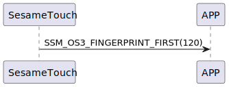

# Item: Finger Start

ssm_touch 收到 `117_finger_get` 後ssm_touch送出 Finger Start 指令，表示接下來要開始傳送卡片資料給手機了(
詳見 `118_finger_notify`)。

## 循序圖

  

## ssm_touch 推送內容

| Byte |     1     |  0   |
|------|:---------:|:----:|
| Data | item_code | type |
| 說明   |   指令編號    | 推送類型 |

type : SSM2_OP_CODE_PUBLISH (0x08)

item code : SSM_OS3_FINGERPRINT_FIRST (120)