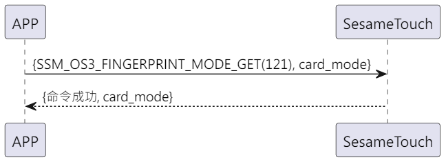

# Item: Finger Mode Get

手機發送新增指令獲取ssm_touch現在處於新增或是驗證指紋模式，sesame5 回覆指令成功及模式。

## 循序圖

  

## 手機送出資料
| Byte | 0         |
|------|:---------:|
| Data | item code |

item code : SSM_OS3_FINGERPRINT_MODE_GET (121)

## ssm_touch 回傳內容
| Byte |    4    | 3   | 2  | 1    | 0  |
|------|:-------:|:---:|:--:|:----:|:--:|
| Data | finger mode | res | item code | type |op code|

type : SSM2_OP_CODE_RESPONSE(0x07)

item code : SSM_OS3_FINGERPRINT_MODE_GET (121)

res : CMD_RESULT_SUCCESS (0x00)

### finger mode

0x00->驗證模式      

0x01->新增模式