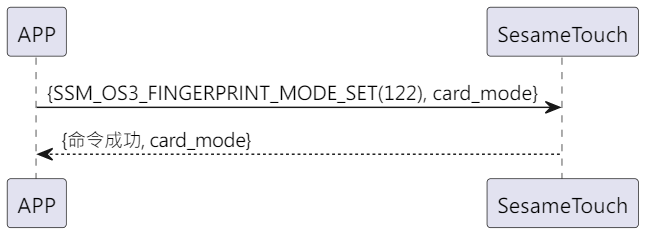

# Item: Finger Mode Set

手機發送新增指令獲取ssm_touch現在處於新增或是驗證指紋模式，sesame5 回覆指令成功及模式。

## 循序圖

  

## 手機送出資料

| Byte |      1      |     0     |
|------|:-----------:|:---------:|
| Data | finger_mode | item code |

item code : SSM_OS3_CARD_MODE_SET (122)

## ssm_touch 回傳內容

| Byte |      3      |  2  |     1     |  0   |
|------|:-----------:|:---:|:---------:|:----:|
| Data | finger mode | res | item code | type |

type : SSM2_OP_CODE_RESPONSE(0x07)

item code : SSM_OS3_CARD_MODE_SET (122)

res : CMD_RESULT_SUCCESS (0x00)

## finger mode

0x00->驗證模式

0x01->新增模式