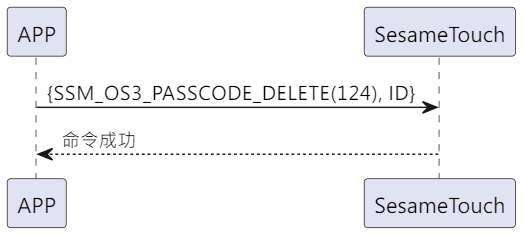

# Item: Password Delete

手機端傳送要刪除的密碼ID，ssm_touch 回傳成功訊息，刪除指定密碼。

## 循序圖

  

## 手機送出資料
| Byte |     1     | 0         |
|------|:---------:|:---------:|
| Data |  pw_id  | item code |

item code : SSM_OS3_PASSCODE_DELETE (124)

pw_id : 要刪除的密碼ID

## ssm_touch 回傳內容
| Byte  | 2      | 1         | 0    |
|-------|:------:|:---------:|:----:|
| Data  | res    | item_code | type |
| 說明   | 命令處裡狀態 | 指令編號      | 推送類型 |

type : SSM2_OP_CODE_RESPONSE (0x07)

item code : SSM_OS3_PASSCODE_DELETE (124)

res : CMD_RESULT_SUCCESS (0x00)

