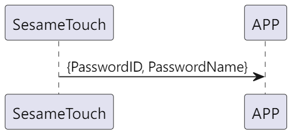

# Item: Password Notify

ssm_touch 主動推送密碼資料給手機。

## 循序圖

  

## ssm_touch 推送內容
| Byte | N ~ 2   | 1         | 0    |
|-------|:------:|:---------:|:----:|
| Data  | payload | item_code | type |
| 說明    | 送給手機的資料 | 指令編號      | 推送類型 |

type : SSM2_OP_CODE_PUBLISH (0x08)

item code : SSM_OS3_FINGERPRINT_NOTIFY (118)

payload : 詳見以下表格

### payload
| Byte | (Password ID Len + Password Name Len + 2)  ~ (Password ID Len + 3) | Password ID Len + 2 | (Password ID Len + 1) ~ 2 | 1           | 0         |
|:----:|:------------------------------------------------------:|:---------------:|:---------------------:|:-----------:|:---------:|
| Data | pw_name                                              | pw_name_len   | pw_id               | pw_id_len | pw_type |

#### 範例
pw_id_len = 7

pw_name_len = 8

| Byte | 17 ~ 10   | 9             | 8 ~ 2   | 1           | 0         |
|:----:|:---------:|:-------------:|:-------:|:-----------:|:---------:|
| Data | pw_name | pw_name_len | pw_id | pw_id_len | pw_type |

